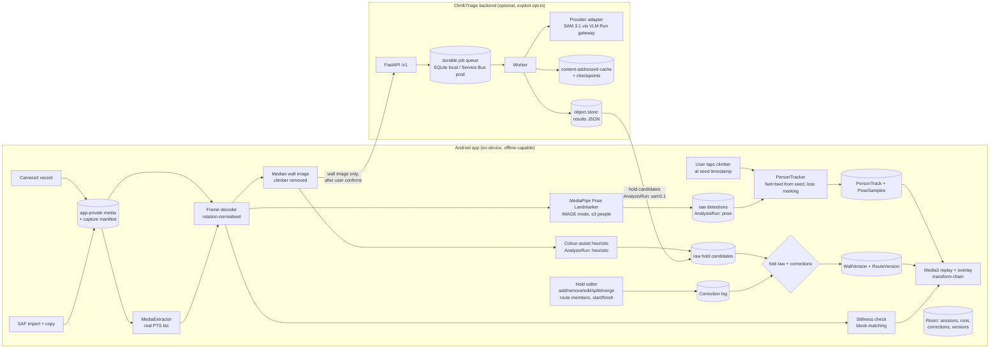

# 02 — Architecture and data flow

## Layers

The design keeps five layers apart, and each depends only on the layers
beneath it:

| Layer | Responsibility | M1 home |
|---|---|---|
| **Capture** | record/import, timestamps, orientation, manifest, app-private media | `android/app/.../capture`, `.../media` |
| **Perception** | pose detection, person identity tracking, hold candidates, stillness check | `.../perception`, `.../holds/detect`, `backend/.../providers` |
| **Climbing-event inference** | contact, attempts, pauses (M2+) | `.../events` (boundary only in M1) |
| **Metrics** | durations, sequences, usage (M2+) | `.../metrics` (boundary only in M1) |
| **Presentation** | Compose UI, replay overlay, editing | `.../ui` |

The contracts in `05-contracts.md` and `contracts/schema/` are the only
cross-layer vocabulary. Perception never computes a climbing metric.
Presentation never runs inference.

## M1 data flow

## Coordinate systems and the transform chain

Every point declares one of these systems (`CoordinateSystem` in the contracts):

| Name | Definition |
|---|---|
| `video_px` | Pixel grid of the *encoded* frame, before the container rotation is applied. |
| `frame_norm` | Display-oriented frame, after rotation and optional un-mirroring, normalised to [0,1]² with the origin top-left. **Canonical for per-frame observations.** |
| `inference_norm` | The normalised coordinates of the bitmap given to a model. If the input was cropped or letterboxed, a stored affine maps it to `frame_norm`. With full-frame resizing it is the identity. |
| `wall_norm` | The wall coordinate system of a `WallVersion`: `frame_norm` of the reference frame for a stationary capture. A per-capture `Registration` maps `frame_norm` → `wall_norm` (identity when stillness is verified). It is a homography only where one is valid, and it is flagged `unreliable` otherwise. |
| `view_px` | On-screen pixels of the player surface, after fit/letterbox. Presentation only; never persisted. |

The chain for drawing is `wall_norm → frame_norm → view_px`. Pose samples are
already in `frame_norm`. `Transform2D` (3×3) composes these steps, and
`ViewportTransform` derives the letterbox from the *display* aspect ratio,
including the rotation. JVM unit tests cover 0/90/180/270 rotation, mirroring
and letterbox/pillarbox.

## Time

- The capture manifest stores the **presentation timestamp (µs) of every video
  sample**, read with `MediaExtractor` and sorted into display order. Analysis
  samples are addressed by `(frameIndex, ptsUs)`.
- Replay looks up the pose sample whose PTS is nearest the player position,
  within half the local analysis interval. Outside that window, it draws
  nothing.
- Live filtering (M4) must be causal. Offline smoothing (M2) may be
  bidirectional, but it must never cross a `LOST` gap.

## Why the tracker is ours, not MediaPipe's

The BlazePose GHUM model card lists single-person video as the intended use.
`numPoses > 1` returns several people per image **without identities**. So
detection runs statelessly (IMAGE mode, up to 3 people per frame), and
`PersonTracker` does association as a pure function over stored detections:

- Seed: the user taps a person at timestamp `t0`, which selects a detection.
- It propagates forward and backward from `t0`. The cost combines bbox IoU,
  normalised torso-keypoint distance, and a velocity-gated position prediction.
- **Accept** only when the best candidate passes the gate *and* beats the
  runner-up by a margin. Otherwise the sample is `AMBIGUOUS` (no landmarks),
  and if nothing is in the gate it is `LOST`.
- After a `LOST` run longer than `maxGap`, the tracker re-acquires only when
  exactly one candidate lies within the expanded gate around the last position.
  Otherwise it stays lost until the user reselects.

Because detections are stored, re-tracking after a user correction is
instant and needs no inference.

## Backend job model

- `POST /v1/uploads` creates a resumable upload. `PUT` sends chunks with
  `Content-Range`, and `HEAD`/`GET` reports the committed offset. Finalising
  verifies the client's SHA-256.
- `POST /v1/jobs` takes an `Idempotency-Key`. The same key with the same body
  returns the same job, and the same key with a different body gets a 409.
  The cache key is `sha256(input) + provider + model + config + schema version`.
  A cache hit completes the job without a provider call.
- The worker is a separate process. Jobs move through
  `queued → running(step k/n) → succeeded | failed | cancelled`. Progress
  counts real completed steps, not a time estimate.
- **Checkpoints**: the raw provider response is persisted before
  post-processing, so a retry never pays for the same provider call twice.
- Retries are bounded (default 3) with exponential backoff and apply only to
  transient errors (timeouts, 429, 5xx).
- **Cancellation** is cooperative. The worker checks between steps.
- **Deletion** writes a tombstone. Workers re-check the tombstone in the same
  transaction that commits results, so a late worker cannot recreate deleted
  data.
- Credentials such as `VLMRUN_API_KEY` live only in the server environment,
  never on the phone.

Portability: SQLite + local files serve for development. Production swaps in
PostgreSQL, Azure Blob Storage and Azure Service Bus behind the same
`JobStore`/`BlobStore`/`Queue` interfaces, on Azure Container Apps (API and
worker as separate apps). Kubernetes is not needed.

## Module boundaries for later work

- `events/` (M2): `ContactInferencer` takes `PersonTrack` + `RouteVersion` +
  `Registration` and produces `ContactEvent`s with explicit `UNKNOWN`
  intervals. Its interface is declared, but M1 does not implement it.
- `capture/depth` (M5): `DepthSource` produces depth frames plus intrinsics
  and the timebase into the manifest. It uses camera-session coordination
  (CameraX and ARCore cannot both own the camera). Only the manifest fields
  exist today.
- `hardware/` (M5): `ExternalCameraAdapter` produces a capture with a
  manifest. It is not implemented.
