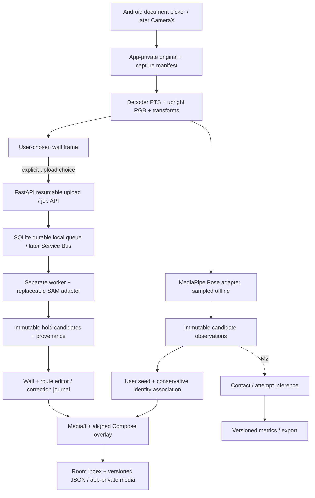

# ClimbTriage engineering specification

Status: first import/review slice; 2026-09-28. No accompanying project plan found. No consented clip supplied. All quality and device performance figures below are targets, not results.

## Product boundary

Help an indoor boulderer review a recording from a stationary, externally positioned phone. The first release imports a clip, runs downloaded on-device pose inference, lets the user explicitly select a person, proposes wall holds through an opt-in backend, edits the wall/route, and replays/saves the result. Guest use requires no account. Manual hold maps, pose and replay work without cloud connectivity after the pose model is installed. Automatic offline hold segmentation is a separate deliverable.

Import is the first working capture adapter. CameraX recording follows in M1b; it must record independently of inference. One selected climber and one stationary view are supported. No live contact feedback, contact analytics, camera movement compensation or metric 3D is implied by the first slice. A camera movement warning/control suppresses static holds; stationary operation still needs device/footage validation.

Holds are wall objects; route membership is a separate user decision. Color and geometry may suggest membership but never identify a route conclusively. The editor must add/remove/edit/split/merge polygons, distinguish volumes, set start/finish explicitly, and retain stable UUIDs apart from display numbers. Editing geometry creates a wall version; route edits create a route version. Split/merge retires parents and creates child IDs with lineage. A physical wall reset creates a new wall ID.

Selected-person identity is a separate algorithm above multi-pose detection. A user-selected seed and conservative association establish a track segment. Ambiguous crossings, low confidence and long gaps produce lost/unknown observations; automatic reacquisition after loss is disabled in the first slice. Reselection begins a new explicit segment. Hidden landmarks are not interpolated. The UI exposes missing coverage and hides stale skeletons.

## Architecture and data flow

Capture owns time and pixel geometry. Perception owns model observations, not climbing semantics. Event inference consumes immutable observations and versioned corrections. Metrics consume events; presentation formats results and exposes uncertainty. A future iOS app shares JSON contracts and conformance vectors, not Android camera code. Hardware/depth adapters emit the same capture manifest. No speculative microservices are needed.

## Stack decisions

| Layer | Decision / tradeoff |
|---|---|
| Android | Kotlin, Compose, coroutines, Media3, Room, app-private originals. Native camera/codec integration; iOS later uses native capture against shared contracts. |
| Pose | MediaPipe Tasks Pose Landmarker, multiple candidates, CPU baseline, downloaded/pinned model. General fitness accuracy does not establish climbing performance. Occlusion and upside-down poses require evaluation. |
| Import timing | MediaExtractor/MediaCodec decoded presentation timestamps, no elapsed-time calculation from FPS; preserve source PTS origin and rotation. Reject changing dimensions, unsupported timestamp ordering or pixel geometry rather than misalign. |
| Hold perception | SAM concept segmentation on a chosen static image; cache geometry. fal SAM 3 adapter has independently published schema; reference VLM Run SAM 3.1 remains an evaluation adapter candidate pending accessible contract and authenticated smoke test. Neither implies phone throughput. |
| Backend | Python/FastAPI, NumPy/OpenCV, separate worker. SQLite durable queue and files for a single-user local prototype; no cloud dependency. Production PostgreSQL + object storage + durable queue behind the same ownership/job boundaries. |
| Deployment | Proposed Azure Container Apps, Blob Storage, Service Bus; portable processes/container. No Kubernetes. Authentication, tenant isolation, quotas and HTTPS are required before public deployment; local service binds loopback. |
| Custom mobile holds | Consider ONNX Runtime Mobile after consented data, held-out quality, model export, licensing and thermal benchmarks. Not a placeholder detector. |

## Time, geometry and uncertainty

Use integer microseconds in the capture timebase. Preserve source PTS and source-to-playback origin. Inference observations use upright normalized video coordinates, x right/y down. Decoder crop and rotation are explicit in the manifest; preview uses a fit rectangle and the same mapping for taps and drawing. Reference-wall coordinates are an identity mapping only for a stationary camera; they are not meters. Live filters must be causal; any future offline smoothing records lookahead and never bridges unknown intervals silently.

Do not use a single homography for arbitrary translation around a non-planar wall. M3 introduces registration confidence, held-out feature residuals, coverage and multi-plane diagnostics; suppress overlays when registration is invalid. M1 exposes a manual suppression control and does not claim automatic registration safety.

Every observation includes time, space, validity, nullable confidence and algorithm/model provenance. Provider scores are not calibrated probabilities. Missing is null/unknown, never zero. Pose `worldLandmarks` are not calibrated wall coordinates. A hip midpoint may be displayed as a labeled body-position proxy, not center of mass. Never infer force, weight distribution, muscle fatigue or a universal technique score. Any language summary may only cite existing metric IDs and timestamps.

## M2 event definitions (not implemented in M1)

Per-limb contact candidates combine mask signed-distance, relative limb/hold motion, landmark reliability, time-based dwell and separate entry/release thresholds. Compare adjacent candidates while attached: a transfer need not pass through a free state. Preserve competing evidence and unknown intervals. Contact is a visual hypothesis, not proof of physical loading. Toe/heel landmarks take precedence when reliable; ankle approximations are labeled. Wall smears and volume surfaces have their own contact target kinds, with no invented hold IDs.

Attempt boundaries apply explicit route-type rules and editable start/finish choices. A boulder finish may require controlled matching as annotated; a timed traverse/top-rope route needs different rules. Highest visible hold is not the finish. Tracking loss is not a fall. Incomplete clips remain censored. Report boundary uncertainty. Contact duration is supported interval time excluding unknown spans, with coverage. Overall sequence is ordered activation events; per-limb sequence preserves simultaneous contacts. Pauses are low-motion intervals; shake-outs may coexist with a pause. A possible rest does not prove recovery or fatigue.

## Acceptance for the first slice

1. Import copies original media privately; failed imports do not appear as complete sessions.
2. Real MediaPipe adapter processes decoded RGB frames with actual PTS; missing model is actionable, not simulated success.
3. User taps a candidate to seed identity. Loss remains visible until explicit reselection.
4. User explicitly sends one keyframe for hold analysis; credentials stay server-side. Missing credentials fail clearly. Empty successful detections differ from provider failure.
5. Polygons and route membership can be corrected and survive save/reopen alongside immutable raw outputs and version history.
6. Media3 replay shows only temporally nearby, valid skeleton joints and stationary hold geometry in the actual letterboxed video rectangle.
7. Job restart, cancellation, idempotency, upload offset conflicts and deletion races have deterministic automated checks. Mock provider payloads validate contracts only, not CV accuracy.
8. An Android build/device run and permitted real inference are separate evidence items. No completion claim without those checks.

## Assumptions / unresolved constraints

No footage, reference phones, provider credential or Android SDK/device was initially available. Backend API availability is verified from documentation, not an authenticated inference run. Model licenses, checkpoint revision, provider retention/region/SLA and production terms need an explicit release record. A pose model download is not consent to upload footage. MediaPipe candidates do not provide persistent person IDs. Imported video codec/color/HDR variability needs a device corpus; first slice supports SDR RGB/YUV decoding, rejects unsupported paths. The short-clip prototype bounds memory/workload and does not claim long-session reliability.

## Prioritized delivery

| Milestone | Scope | Exit evidence |
|---|---|---|
| M1a (this slice) | Import, local pose candidates, selection/loss, opt-in SAM holds, polygon/route edits, saved aligned replay | Build + contract tests; real clip/device smoke pending prerequisites |
| M1b | CameraX independent recording, lifecycle/background interruption handling, model download UX, robust clip library, automatic static-camera drift guard, validation/refinement of color/geometry suggestions | Physical-device import/record/reopen and crossing/rotation/crop matrix |
| M2 | Contact state machine, attempts, per-limb sequence/durations/usage, corrections, JSON/CSV/rendered video export | Consented annotated contact/boundary evaluation; uncertainty shown |
| M3 | Handheld registration/mosaic, missed-hold recovery, same-route comparison, pauses/rest candidates, traces/heatmaps | Registration suppression and cross-session wall-ID validation |
| M4 | Validated causal live feedback; compact offline automatic holds | Phone performance/thermal and untouched automatic-quality gates |
| M5 | Optional synchronized depth/3D, calibration and dedicated-camera adapters | Depth/time/calibration error budgets, camera session coordination, cross-capture registration |
| Optional | Reference chin-up counting/timing, running cadence/gait, dance synchronization/comparison | Independently prioritized; no climbing dependency |

## Evaluation plan

Recruit consented participants and gyms; retain a withdrawal/deletion ledger, clip license/consent scope and annotation history. Pilot 30 clips to refine labels, then a proposed 150+ clip evaluation corpus across at least 3 gyms, 20 climbers and multiple route styles. Final sample size depends on confidence interval width and scenario coverage. Group split by climber, route and gym (a graph grouping all shared identities), with an untouched gym holdout; frames from a clip cannot cross splits. Annotators label visible hold masks, volumes, selected-person identity, visible landmarks, per-limb contacts/unknowns, smears, start/finish and censored boundaries. Double annotate a subset and adjudicate disagreement; quantify agreement.

Report uncorrected predictions first; separately report correction time and corrected quality. Visible-hold precision/recall each target >=90% at mask IoU .5, one-to-one matching. Per-limb contact precision >=90%, recall >=85% with correct limb/hold and interval IoU >=.5. Boundary median absolute error <=.5 s for unambiguous complete attempts, plus p90 and signed error. Report confidence intervals by clip, per-scenario scores, identity switches, false reacquisitions, sample/time coverage, abstention, and onset/release timing errors. Never remove difficult failures from denominators; distinguish genuinely unobservable labels from missed predictions. Targets may change only in a dated decision with feasibility evidence.

Proposed reference phones: Pixel 8 (8 GB) and Samsung Galaxy A54 5G (6/8 GB; record exact SKU), pending access. Target >=15 live pose updates/s, p95 capture-to-overlay age <200 ms; run ten-minute thermal capture tests at documented resolution/model/delegate, measuring frame drops, inference coverage, temperature, battery and recording continuity. No measurements yet. Stress rotation, crop, letterbox, wrong-person crossing, identical clothes, occlusion, long gaps, neighboring same-color holds, adjacent transfers, smears, VFR/B-frames, interruptions, failed/duplicate uploads, worker restart/deletion and network timeouts. Synthetic tests can test algorithms; only real annotated footage supports model-quality claims.

Depth manifest fields: depth resource format/units, invalid sentinel, per-sample timestamp, timebase offset/drift, RGB/depth intrinsics, distortion, extrinsics, camera pose and covariance, calibration method/version/validation. Depth is optional; not all Android devices support it. ARCore depth quality depends on motion/scene/device and needs experiments for a static camera with a moving subject. CameraX and ARCore must coordinate camera ownership (shared-camera adapter or exclusive mode); no assumption of concurrent independent sessions. Display meters only after validated calibration and error bounds.
